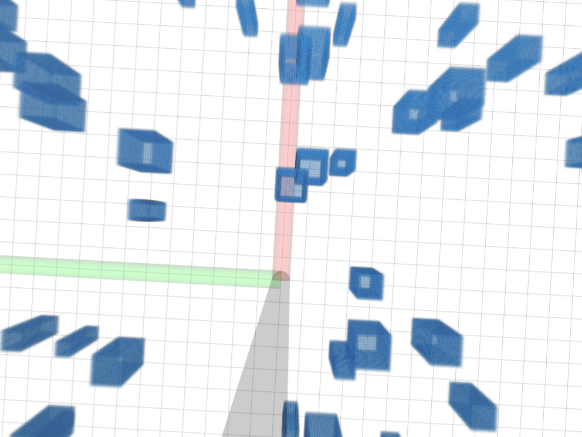
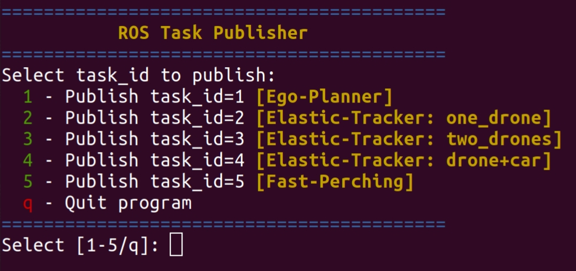

# 1. Overview
This project combines three previous projects from ZJU-FAST-Lab: ego-planner, Elastic-Tracker, Fast-Perching. By running a single bash file, you can run one of these projects in one unified simulation environment.
# 2. Standard Compilation
**System used to test**: Ubuntu 20.04 with ros-noetic  

**[NOTE!]** Remember to change the CUDA option of src/uav_simulator/local_sensing/CMakeLists.txt in both ego-planner and Elastic-Tracker packages.
> Clone the code from github
```
git clone https://github.com/wuuwuu26/Integrated-Simulation.git
```
> Compile each package one by one
```
cd ego-planner
catkin_make
```
```
cd Elastic-Tracker
catkin_make
```
```
cd Fast-Perching
catkin_make
```
> Grant bash files permissions
```
chmod +x run.sh
chmod +x task_pub.sh
```
> Run the map and wait for `/task_id`
```
./run.sh
```

> Run task publisher
```
./task_pub.sh
```

# 3. About Task Publisher
After publishing task 2 or 3, you need to type in "y" or "Y" to trigger the tracking program. The tracking program can also use topic `/tracking` to judge whether to publish the tracking message. If `/tracking` equals 1, start tracking.  

After publishing task 4, you need to not only type in "y" or "Y" to trigger the landing program, but also type in "y" or "Y" then to trigger the landing program. The landing program can also use topic `/landing` to judge whether to publish the landing message. If `/landing` equals 1, start landing.
# 4. About the Map
If you want to change the map, please turn to `/ego-planner/src/planner/plan_manage/launch/map_generator.launch`. You can change the parameters of `mockamap_node` to get a different environment for simulation.
```
<param name="seed" type="int" value="510"/>
<param name="update_freq" type="double" value="1.0"/>

<!-- Box edge length, unit: meter -->
<param name="resolution" type="double" value="0.1"/>

<!-- Map size unit: meter -->
<param name="x_length" value="$(arg map_size_x_)"/>
<param name="y_length" value="$(arg map_size_y_)"/>
<param name="z_length" value="$(arg map_size_z_)"/>

<!-- Map generation type: 2 = perlin box random map -->
<param name="type" type="int" value="2"/>
    
<!-- Ground parameter: 1 = enable ground, 0 = disable ground -->
<param name="ground" type="int" value="0"/>
    
<!-- Perlin box random map parameters -->
<param name="width_min" type="double" value="0.5"/>
<param name="width_max" type="double" value="1.5"/>
<param name="height_min" type="double" value="3.5"/>
<param name="height_max" type="double" value="4.5"/>
<param name="obstacle_number" type="int" value="120"/>
```
# 5. Existing Problems
As for task 5, given that there's no obstacle avoidance program in Fast-Perching project, task 5 here can't avoid the obstacles in the map. 
# 6. Application
For an AI model, you can use topics `/task_id` (1~5), `/tracking` (0/1) and `/landing` (0/1) as interfaces.  
